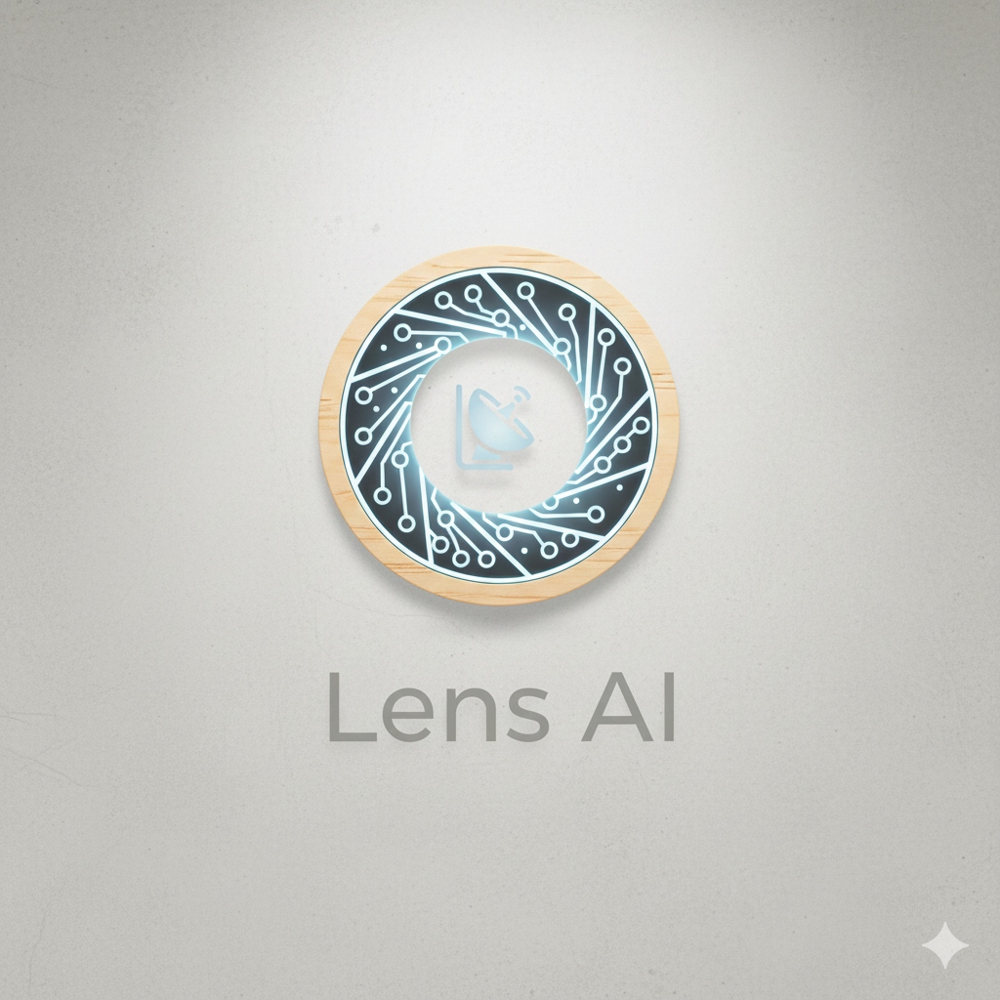

<p align="center">
  
</p>

<h1 align="center">🔭 LensAI</h1>

<p align="center">
  <strong>We filter the noise to bring you the core of AI evolution.</strong><br>
  <em>Sharp analysis, organic design, zero filler.</em>
</p>

<p align="center">
  <a href="#features">Features</a> •
  <a href="#architecture">Architecture</a> •
  <a href="#installation">Installation</a> •
  <a href="#deployment">Deployment</a> •
  <a href="#usage">Usage</a> •
  <a href="#cost">Cost</a>
</p>

---

## 🎯 What is LensAI?

LensAI is an AI-powered **tech news aggregator** that delivers personalized daily digests via Telegram. It scrapes top tech sources, summarizes them with AI, and sends you the most important stories — so you never miss what matters in AI and tech.

### Key Highlights

- 📰 **Multi-source aggregation** — Hacker News, TechCrunch, AI company blogs, The Verge, GitHub Trending
- 🤖 **AI summarization** — DeepSeek creates digestible, curated digests
- 🔖 **Article saving** — Save interesting articles to your personal collection
- 💬 **Q&A Chat** — Ask any tech question and get AI-powered answers
- ⏰ **Scheduled delivery** — Set your preferred daily digest time
- 🌐 **Multi-language** — Full support for English, Russian, and Azerbaijani
- ☁️ **Cloud-native** — Runs 24/7 on Google Cloud Functions with Firestore

---

## ✨ Features

| Feature | Description |
|---------|-------------|
| 📰 **News Scraping** | Fetches from Hacker News, TechCrunch, AI blogs (Anthropic, OpenAI, Mistral, DeepMind), The Verge, GitHub Trending |
| 🧠 **AI Summarization** | Uses DeepSeek to create engaging, categorized news digests |
| 🔖 **Save Articles** | Save articles to Firestore with automatic categorization (AI, Security, Crypto, etc.) |
| 💬 **Interactive Q&A** | Ask questions about any tech topic and get AI responses |
| ⚡ **Smart Caching** | 15-minute cache prevents redundant API calls |
| 🔒 **Distributed Lock** | Firestore-based locking prevents duplicate message sends |
| 🎛️ **Source Control** | Toggle news sources on/off via inline buttons |
| ⏰ **Custom Scheduling** | Set your preferred daily digest delivery time |
| 🌐 **Multi-language** | English, Russian, and Azerbaijani support |

---

## 🏗️ Architecture

```
┌──────────────────────────────────────────────────────────┐
│                    GOOGLE CLOUD                          │
├──────────────────────────────────────────────────────────┤
│                                                          │
│  ┌──────────────┐    ┌──────────────┐                   │
│  │ Cloud        │───▶│ Cloud        │                   │
│  │ Scheduler    │    │ Functions    │                   │
│  │ (your time)  │    │ (Python 3.11)│                   │
│  └──────────────┘    └──────┬───────┘                   │
│                             │                           │
│  ┌──────────────┐          │      ┌──────────────┐     │
│  │ Firestore    │◀─────────┼─────▶│ Telegram     │     │
│  │ Database     │          │      │ Bot API      │     │
│  │ • Users      │          │      └──────┬───────┘     │
│  │ • Articles   │          │             │             │
│  │ • Locks      │          │             │             │
│  └──────────────┘          │             │             │
│                            │             │             │
│  ┌──────────────┐          │             │             │
│  │ Secret       │◀─────────┘             │             │
│  │ Manager      │                        │             │
│  └──────────────┘                        │             │
│                                          │             │
└──────────────────────────────────────────┼─────────────┘
                                           │
         ┌─────────────────────────────────┘
         │
    ┌────┴──────┐                   ┌──────────────┐
    │   News    │                   │     YOU      │
    │  Sources  │                   │  (Telegram)  │
    │ • HN      │                   └──────────────┘
    │ • TC      │
    │ • AI      │
    │ • Verge   │
    │ • GitHub  │
    └───────────┘
```

---

## 📁 Project Structure

```
LensAI/
├── functions/                    # Cloud Functions code
│   ├── main.py                  # HTTP endpoints
│   ├── telegram_bot.py          # Bot commands & handlers
│   ├── summarizer.py            # DeepSeek AI integration
│   ├── cache.py                 # In-memory caching
│   ├── database.py              # Firestore operations
│   ├── scrapers/
│   │   ├── hackernews.py        # Hacker News API
│   │   ├── techcrunch.py        # TechCrunch RSS
│   │   └── ai_blogs.py          # AI company blogs
│   └── requirements.txt
├── run_local.py                 # Local development runner
├── test_scrapers.py             # Scraper tests
├── .env.example                 # Environment template
├── .gitignore                   # Security exclusions
├── logo.jpg                     # Project logo
└── README.md                    # This file
```

---

## 🚀 Installation

### Prerequisites

- Python 3.11+
- [Google Cloud CLI](https://cloud.google.com/sdk/docs/install) (for deployment)
- Telegram account
- DeepSeek API key ([Get one here](https://platform.deepseek.com))

### Local Development

```bash
# Clone the repository
git clone https://github.com/YOUR_USERNAME/LensAI.git
cd LensAI

# Create virtual environment
python -m venv venv
venv\Scripts\activate  # Windows
# source venv/bin/activate  # macOS/Linux

# Install dependencies
pip install -r functions/requirements.txt python-dotenv

# Set up environment variables
cp .env.example .env
# Edit .env with your API keys

# Run locally
python run_local.py
```

---

## ☁️ Deployment

### Deploy to Google Cloud Functions

```bash
# 1. Login to Google Cloud
gcloud auth login

# 2. Set your project
gcloud config set project YOUR_PROJECT_ID

# 3. Enable required APIs
gcloud services enable cloudfunctions.googleapis.com cloudbuild.googleapis.com run.googleapis.com secretmanager.googleapis.com

# 4. Store secrets
gcloud secrets create TELEGRAM_BOT_TOKEN --replication-policy="automatic"
echo "YOUR_TOKEN" | gcloud secrets versions add TELEGRAM_BOT_TOKEN --data-file=-

gcloud secrets create DEEPSEEK_API_KEY --replication-policy="automatic"
echo "YOUR_KEY" | gcloud secrets versions add DEEPSEEK_API_KEY --data-file=-

# 5. Grant permissions
gcloud secrets add-iam-policy-binding TELEGRAM_BOT_TOKEN \
  --member="serviceAccount:YOUR_PROJECT_NUMBER-compute@developer.gserviceaccount.com" \
  --role="roles/secretmanager.secretAccessor"

gcloud secrets add-iam-policy-binding DEEPSEEK_API_KEY \
  --member="serviceAccount:YOUR_PROJECT_NUMBER-compute@developer.gserviceaccount.com" \
  --role="roles/secretmanager.secretAccessor"

# 6. Deploy function
gcloud functions deploy telegram_webhook \
  --gen2 \
  --runtime=python311 \
  --region=europe-west1 \
  --source=functions \
  --entry-point=telegram_webhook \
  --trigger-http \
  --allow-unauthenticated \
  --set-secrets="TELEGRAM_BOT_TOKEN=TELEGRAM_BOT_TOKEN:latest,DEEPSEEK_API_KEY=DEEPSEEK_API_KEY:latest" \
  --memory=512MB \
  --timeout=300s

# 7. Set Telegram webhook
curl "https://api.telegram.org/botYOUR_TOKEN/setWebhook?url=YOUR_FUNCTION_URL"
```

---

## 📱 Usage

### Bot Commands

| Command | Description |
|---------|-------------|
| `/start` | Welcome message with quick action buttons |
| `/news` | Get your personalized news digest |
| `/settime HH:MM` | Set daily digest time (24h format) |
| `/sources` | Toggle news sources on/off |
| `/status` | View your current settings |
| `/help` | Show all commands |
| **Any text** | Ask a question — AI will answer! |

### Quick Action Buttons

The bot provides persistent keyboard buttons for fast access:

- 📰 **Get News** — Fetch latest digest
- ⚙️ **Settings** — Manage sources
- 📊 **Status** — View settings
- ❓ **Help** — Show help

---

## 💰 Cost

LensAI is designed to be extremely cost-effective:

| Service | Monthly Cost |
|---------|-------------|
| DeepSeek API | ~$1-3 |
| Google Cloud Functions | Free tier (2M invocations) |
| Secret Manager | Free tier |
| **Total** | **~$1-5/month** |

---

## 🔒 Security

- ✅ API keys stored in Google Cloud Secret Manager
- ✅ `.env` files excluded from version control
- ✅ No hardcoded credentials in source code
- ✅ HTTPS-only webhook communication

---

## 🛠️ Tech Stack

- **Language:** Python 3.11
- **Bot Framework:** python-telegram-bot
- **AI:** DeepSeek API (OpenAI-compatible)
- **Cloud:** Google Cloud Functions (Gen 2)
- **Scraping:** httpx, BeautifulSoup, feedparser

---

## 📄 License

MIT License — feel free to use, modify, and distribute.

---

## 🤝 Contributing

Contributions are welcome! Please feel free to submit a Pull Request.

---

<p align="center">
  Made with ❤️ by <a href="https://github.com/AminSS99">Amin Sobor</a>
</p>
